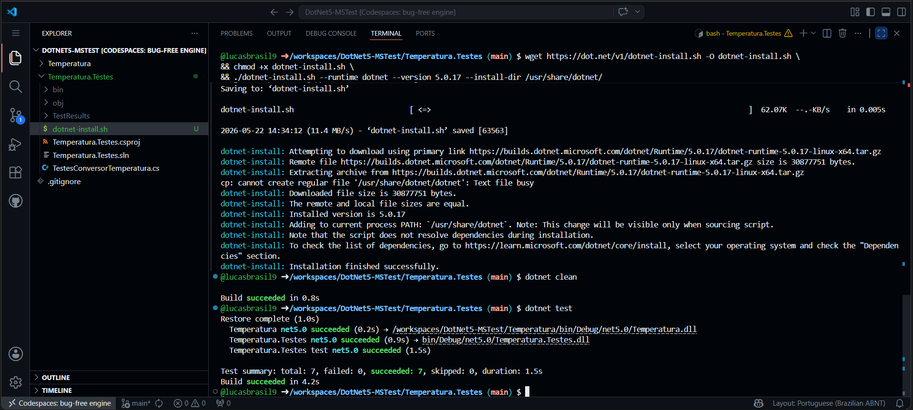
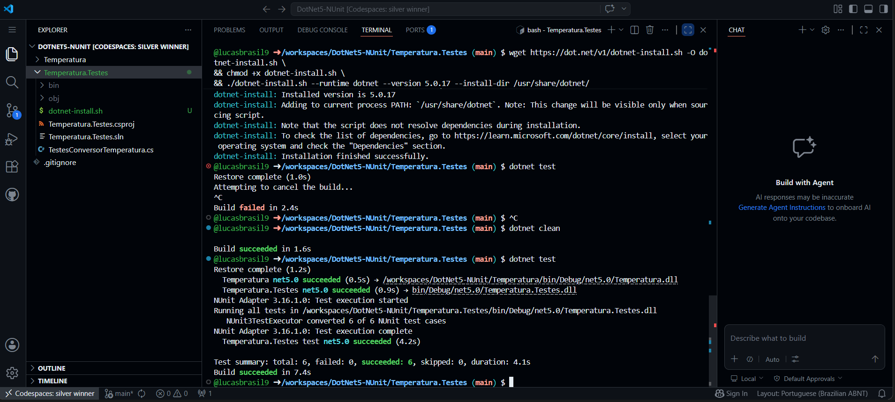
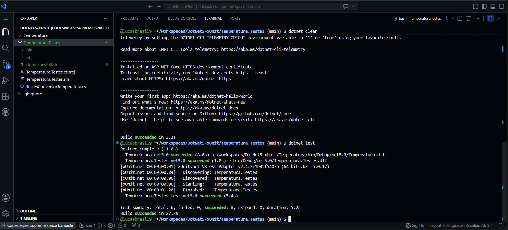

# Aplicando Testes de Software com .NET

Este repositório foi desenvolvido com o objetivo de demonstrar a implementação prática de três dos principais frameworks de testes utilizados no ecossistema .NET: **MSTest**, **NUnit** e **xUnit**. 

A aplicação de referência utilizada para os testes consiste em uma biblioteca de conversão de temperaturas, focada em transformar graus **Fahrenheit para Celsius**, seguindo a fórmula:
`Celsius = (Fahrenheit - 32) / 1.8`

## 1. MSTest (Microsoft.VisualStudio.TestTools.UnitTesting)

### Aplicação do Teste
O **MSTest** é o framework de testes padrão da Microsoft, integrado nativamente ao Visual Studio. Ele utiliza convenções bem definidas por meio de atributos como `[TestClass]` para identificar classes de teste e `[TestMethod]` para os métodos de teste. A validação do resultado esperado versus o resultado obtido é realizada através da classe estática `Assert` (ex: `Assert.AreEqual`).

### Cenários de Exemplo

#### Cenário 1: Conversão do Ponto de Congelamento da Água
* **Entrada (Fahrenheit):** `32.0`
* **Resultado Esperado (Celsius):** `0.0`
* **Explicação:** Valida se o ponto de congelamento padrão (32°F) é convertido corretamente para o equivalente exato a 0°C.

#### Cenário 2: Conversão de Temperatura Negativa em Celsius
* **Entrada (Fahrenheit):** `14.0`
* **Resultado Esperado (Celsius):** `-10.0`
* **Explicação:** Garante que o cálculo permanece preciso quando o resultado da conversão resulta em uma temperatura abaixo de zero grau Celsius.

### Execução do Teste
Aqui está o registro da execução bem-sucedida utilizando a suíte do MSTest:

## 2. NUnit

### Aplicação do Teste
O **NUnit** é um framework de código aberto altamente popular e amplamente portado do ecossistema Java (JUnit). Diferente do MSTest, ele identifica as classes de teste utilizando o atributo `[TestFixture]` e os métodos com `[Test]`. Uma de suas grandes vantagens é a flexibilidade em sua sintaxe de asserção, permitindo tanto o modelo clássico (`Assert.AreEqual`) quanto um modelo baseado em restrições mais legível (`Assert.That(resultado, Is.EqualTo(esperado))`).

### Cenários de Exemplo

#### Cenário 1: Conversão do Ponto de Ebulição da Água
* **Entrada (Fahrenheit):** `212.0`
* **Resultado Esperado (Celsius):** `100.0`
* **Explicação:** Testa a precisão do algoritmo no ponto máximo de ebulição da água sob pressão atmosférica normal.

#### Cenário 2: Conversão de uma Temperatura Ambiente Comum
* **Entrada (Fahrenheit):** `77.0`
* **Resultado Esperado (Celsius):** `25.0`
* **Explicação:** Valida um cenário comum do dia a dia (clima temperado/ambiente) para conferir a exatidão com casas decimais zeradas.

### Execução do Teste
Aqui está o registro da execução bem-sucedida utilizando a suíte do NUnit:

## 3. xUnit

### Aplicação do Teste
O **xUnit.net** é uma ferramenta moderna, focada no futuro, construída do zero especificamente para a plataforma .NET Core/.NET moderno. Ele elimina atributos redundantes: não exige um atributo específico na classe de teste, e os métodos são decorados simplesmente com `[Fact]` (para testes fixos individuais) ou `[Theory]` (para testes parametrizados orientados a dados, acompanhados de `[InlineData]`). O xUnit incentiva boas práticas de design ao isolar completamente cada execução de teste em novas instâncias de classe.

### Cenários de Exemplo

#### Cenário 1: Conversão Parametrizada (Múltiplos Valores Básicos)
* **Entradas Testadas (Fahrenheit):** `32.0`, `86.0`, `212.0`
* **Resultados Esperados (Celsius):** `0.0`, `30.0`, `100.0`
* **Explicação:** Através do recurso `[Theory]`, injetamos múltiplos valores em um único bloco de código estruturado para validar a integridade da fórmula em larga escala.

#### Cenário 2: Conversão de Valores com Dízimas ou Decimais Fracionados
* **Entrada (Fahrenheit):** `47.0`
* **Resultado Esperado (Celsius):** `8.33` (com arredondamento configurado)
* **Explicação:** Verifica como o framework e o método de conversão lidam com dízimas periódicas e arredondamentos matemáticos necessários na física térmica.

### Execução do Teste
Aqui está o registro da execução bem-sucedida utilizando a suíte do xUnit:

